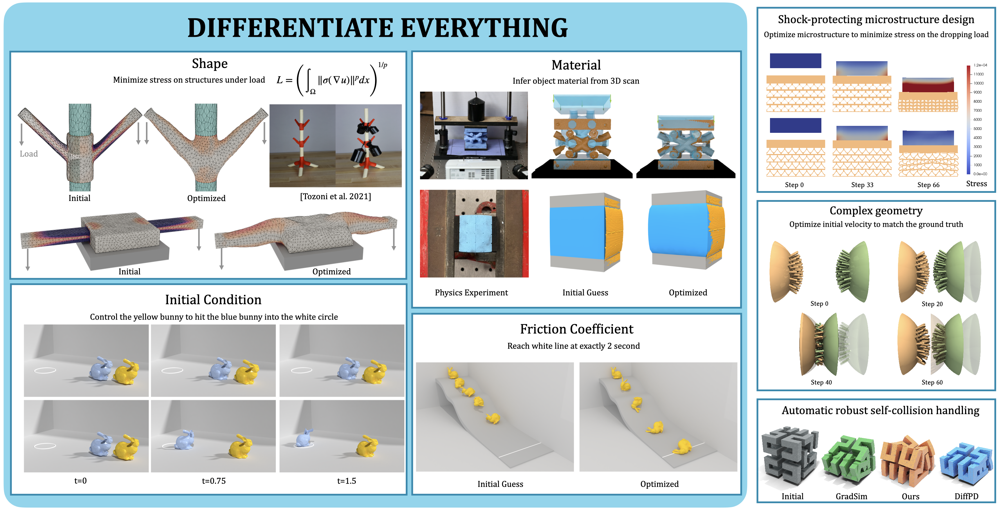

# [Siggraph 2024] Differentiable solver for time-dependent deformation problems with contact



A repository of the data and script used in our work, ["Differentiable solver for time-dependent deformation problems with contact" [Huang et al. 2024]](https://cims.nyu.edu/~zh1476/research/diffipc.html). See [page](https://cims.nyu.edu/gcl/papers/2024-dpolyfem.mp4) for the video of examples in this repository.

# Usage

The source code is integrated in the open-source library [PolyFEM](https://polyfem.github.io/). See [PolyFEM Documentation](https://polyfem.github.io/polyfem/index.html) for compilation of PolyFEM and its JSON interface.

## Environment

The PolyFEM library automatically downloads its dependencies with cmake. The default linear solver in simulations is `Eigen::PardisoLDLT`, which requires [MKL](https://www.intel.com/content/www/us/en/developer/tools/oneapi/onemkl.html), it's not available on MacOS with Apple silicon, in which case `Eigen::AccelerateLDLT` or `Eigen::CholmodSimplicialLDLT` are recommended.

For shape optimizations, jupyter notebooks are provided to manage the optimizations with remeshing. The dependencies used in python are available in anaconda, with the only non-default library [meshio](https://github.com/conda-forge/meshio-feedstock).

## Tutorial

Please refer to the [IPC guide](https://polyfem.github.io/tutorials/ipc_quick_start_guide/ipc_quick_start_guide/) for setting up a simulation of soft bodies with frictional contact in [PolyFEM](https://polyfem.github.io/), and [Trajectory Optimization](https://polyfem.github.io/tutorials/trajectory-optimization/trajectory-optimization/) page for setting up a trajectory optimization using the JSON interface.

## Run examples with JSON

Each example folder in `./json_scripts` includes one optimization JSON file for the configuration of the optimization, and one or more simulation JSON files for the configuration of the physics simulations.

For non-shape optimizations, `cd` to the example folder and use the command
```
~/polyfem/build/PolyFEM_bin -j opt.json --ns
```
to run the code. 

Since shape optimizations (Fig 6 - 12) need remeshing when the mesh quality gets bad, a jupyter notebook is provided in each folder to organize the optimization. The python script calls the polyfem binary to run the shape optimization iteratively: Once the mesh quality reaches a low threshold (e.g. scaled Jacobian is 1e-7), the optimization program stops and the remeshing tool ([Gmsh](https://gmsh.info) for 2D, [MMG](https://github.com/MmgTools/mmg) for 3D) generates a volumetric mesh with better quality while preserving the surface shape.

## Run examples with Python

Examples in `./python_scripts` show how to use the Python binding of PolyFEM to set up an optimization problem. The Python binding of PolyFEM can be found on this [page](https://github.com/Huangzizhou/polyfem-python). Extra libraries needed can be installed via conda:
```
conda install igl conda-forge::meshio
```

The differentiable simulator is wrapped into a Pytorch autograd class, which can be integrated into a training pipeline and be used as a differentiable computing block to construct your own loss functions.

The four examples of running optimization with python binding include [shape optimization](./python_scripts/fig6_static_bridge/), [material optimization](./python_scripts/fig16_sine_bar/), [initial velocity optimization](./python_scripts/fig14_puzzle_piece/), and [friction coefficient optimization](./python_scripts/fig21_friction_bunny/). The Python binding of PolyFEM is under construction, more examples are coming soon!

## Output

The objective and its gradient norm at each iteration are reported in the log. The simulation results are exported as [VTK format](https://docs.vtk.org/en/latest/design_documents/VTKFileFormats.html) and can be visualized in [Paraview](https://www.paraview.org). The transient result files have the format of `step_{t}`, where `t` is the time step; optimization result files have the format of `opt_state_{i}_iter_{j}`, where `i` is the ID of the simulation (in the case where multiple simulations are included), `j` is the iteration number of the optimization.

## Known issues

1. Shape optimizations cannot have obstacles in the simulations. To get around, create a volumetric mesh of the obstacle and apply Dirichlet boundary conditions on the obstacle surface.

2. Shape derivatives is not available on nodes with nonzero Neumann boundary conditions. One can still set Neumann boundary conditions on the shape, but the surface parts with Neumann boundary conditions should be fixed.

3. Density (or mass) and force magnitude (i.e. Neumann boundary condition) optimizations are not supported yet.

# Citation
If you use this work/data. Please cite our paper:

```
@article{10.1145/3657648,
author = {Huang, Zizhou and Tozoni, Davi Colli and Gjoka, Arvi and Ferguson, Zachary and Schneider, Teseo and Panozzo, Daniele and Zorin, Denis},
title = {Differentiable solver for time-dependent deformation problems with contact},
year = {2024},
issue_date = {June 2024},
publisher = {Association for Computing Machinery},
address = {New York, NY, USA},
volume = {43},
number = {3},
issn = {0730-0301},
url = {https://doi.org/10.1145/3657648},
doi = {10.1145/3657648},
abstract = {We introduce a general differentiable solver for time-dependent deformation problems with contact and friction. Our approach uses a finite element discretization with a high-order time integrator coupled with the recently proposed incremental potential contact method for handling contact and friction forces to solve ODE- and PDE-constrained optimization problems on scenes with complex geometry. It supports static and dynamic problems and differentiation with respect to all physical parameters involved in the physical problem description, which include shape, material parameters, friction parameters, and initial conditions. Our analytically derived adjoint formulation is efficient, with a small overhead (typically less than 10\% for nonlinear problems) over the forward simulation, and shares many similarities with the forward problem, allowing the reuse of large parts of existing forward simulator code.We implement our approach on top of the open-source PolyFEM library and demonstrate the applicability of our solver to shape design, initial condition optimization, and material estimation on both simulated results and physical validations.},
journal = {ACM Trans. Graph.},
month = {may},
articleno = {31},
numpages = {30},
keywords = {Differentiable simulation, finite element method, elastodynamics, frictional contact}
}
```
